# Практичсекая работа №2. Регулярные выражения, грамматики и языки
## Цель работы
Реализация и исследование регулярных выражений, регулярных грамматик и свойств регулярных языков, а также доказательство нерегулярности языков.

## Вариант задания
**Вариант 8.**  
Часть 1, 2
Язык $L_8$ = {w принадлежит {0,1}* : w содержит ровно одну пару 
последовательных нулей }.
Часть 3
Язык $L_{34}$ представляет собой строки из 0 и 1 вида $w1^n$, где w — 
строка из 0 и 1 длиной n.

# Часть 1
## Полученное регулярное выражение

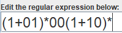

## Перехваты экрана при преобразовании

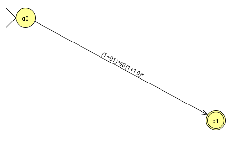

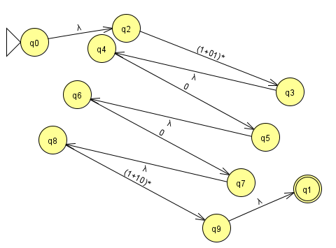

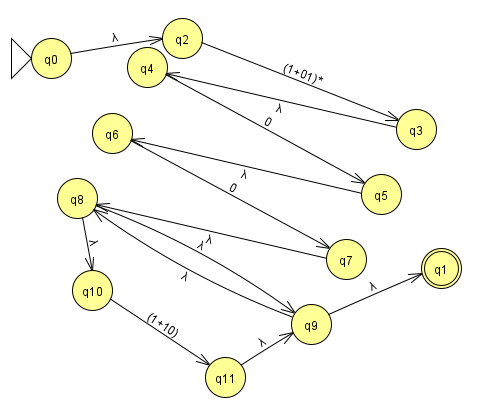

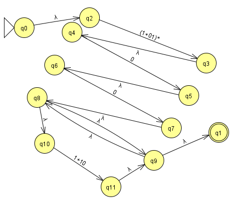

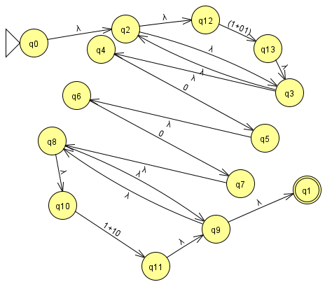

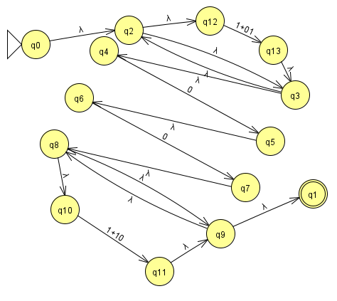

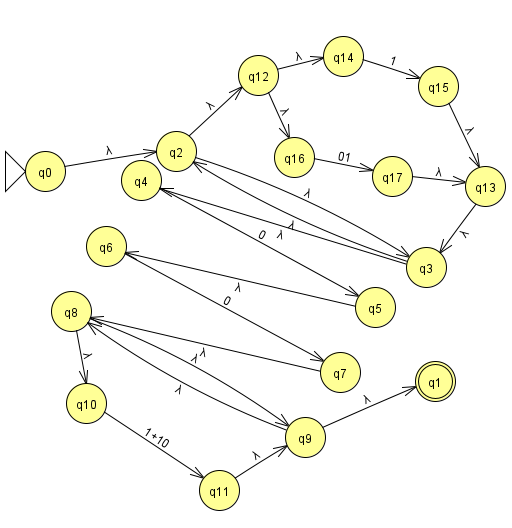

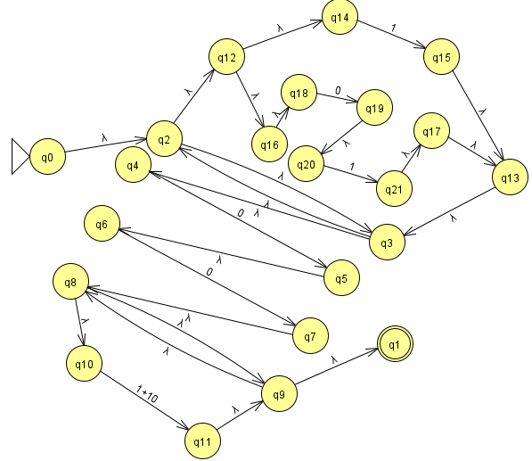

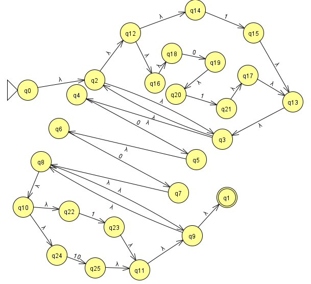

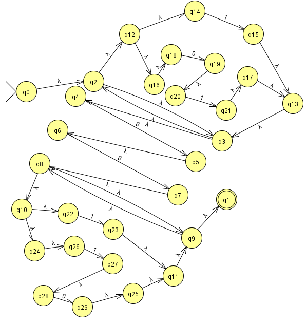

# Часть 2

## Регулярная грамматика

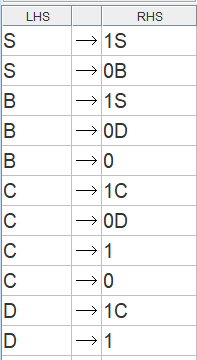

## Преообразование в КА
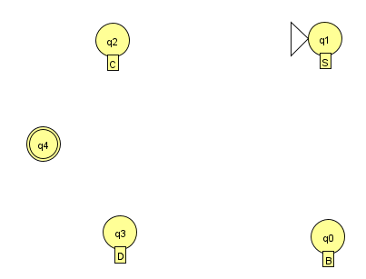

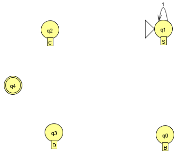

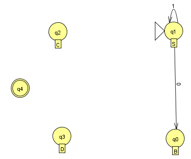

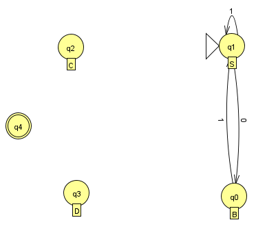

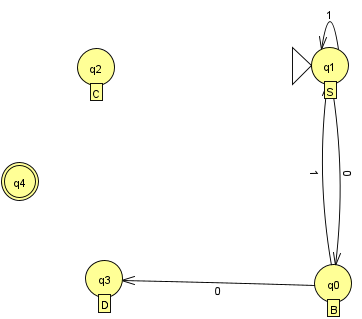

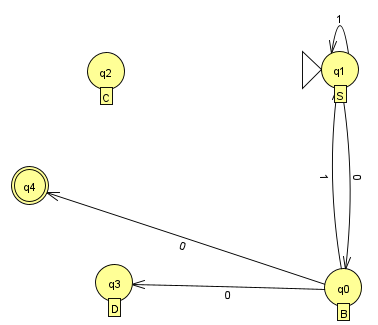

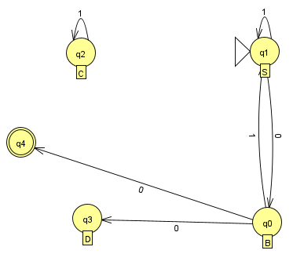

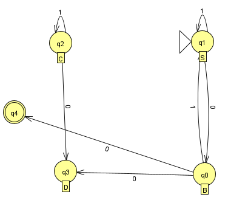

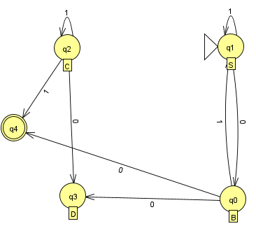

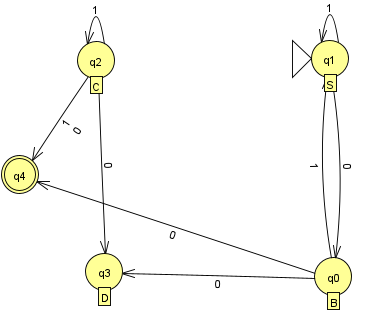

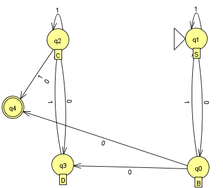

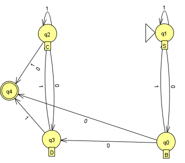

## Преобразование в РВ
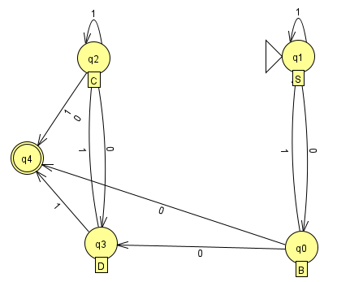

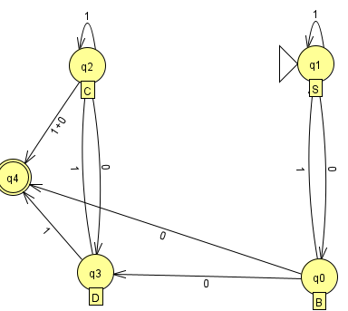

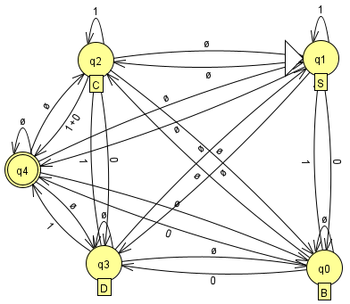

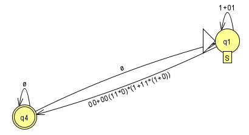

## Полученное регулярное выражение
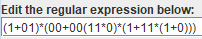

# Часть 3

$L = \{\ w{1^n}\ |\ w \in \{0,1\}^*,\  |w|=n, \ n\geq 0 \}$

Докажем что $L$ не принадлежит к классу РЯ

Доказывать будем от противного :

Пусть $L$ принадлежит к классу РЯ. Тогда по лемме о разрастании для РЯ существует такое $n \geq 1$, что любую строку $w \in L$ $|w| \geq n$ можно разбить на три строки $w = xyz$, где

- $|xy| \leq n$ 
- $|y| \geq 1$
- для $\forall \ k$ $xy^kz \in L$

Тогда выберем строку $w = 0^n 1^n$, она принадлежит $L$, так как можно взять $s = 0^p$, $|s|=n$. То есть $w = s1^{|s|}$ 

По лемме $w=xyz$, причём $|xy|\leq n$. Первые $n$ символов строки $w$ — это нули, поэтому $y$ состоит только из нулей. Значит,

$y=0^k,\qquad k\ge 1.$

Рассмотрим слово
$w'=xy^2z.$ Так как $y=0^k$, получаем $w'=0^{n+k}1^n.$

Если $L$ регулярен, то по лемме $w'\in L$. Но проверим, может ли $w'$ принадлежать $L$.

Если $w'\in L$, то оно должно иметь вид $s1^p$, где $|s|=p$. Тогда длина строки равна 

$|w'|=2p.$

Но 

$|w'|=n+k+n=2n+k.$

Следовательно,

$p=\frac{2n+k}{2}=n+\frac{k}{2}.$

Поскольку $k\ge 1$, имеем $p>n.$

Это значит, что в строке $w'$ должно быть $p$ завершающих единиц, то есть больше $n$ единиц подряд в конце. Однако в строке

$w'=0^{n+k}1^n$

в конце стоит ровно $n$ единиц. Значит, $w'\notin L$.

Получили противоречие с леммой о разрастании для РЯ.

А значит язык $L=\{w1^n \mid w\in\{0,1\}^n,\ n\ge 0\}$ не принадлежит к классу РЯ.
